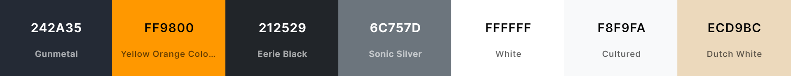
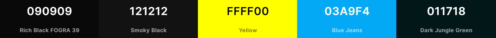
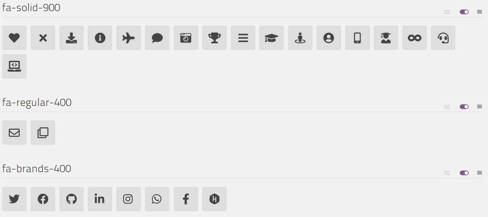

<h1 align="center">
	<p align="center">
		
		
		
		
		
		
		
		
		 
	</p>
</h1>

<br/>


## Design :art:

### Fonts

[Black Ops One](https://fonts.google.com/specimen/Black+Ops+One) - Text Style


### Color Scheme

#### Main Screen

- **Gunmetal** - Primary theme color
- **Yellow Orange Color Wheel** - Secondary theme color
- **Eerie Black** - Dark Text Color
- **Sonic Silver** - Muted Text Color
- **White** - Text Color
- **Cultured** - Light Text Color & Light Background Color
- **Dutch White** - Waifu Tips Background Color

<a href="https://coolors.co/242a35-ff9800-212529-6c757d-ffffff-f8f9fa-ecd9bc">
  
</a>

<br/>
<br/>

#### Splash Screen & 404 Page

- **Rich Black FOGRA 39** - Background Color of Splash Screen
- **Smoky Black** - Path of Splash Circle of Splash Screen
- **Yellow** - Outer Splash Circle color
- **Blue Jeans** - Inner Splash Circle color
- **Dark Jungle Green** - 404 Text Color

<a href="https://coolors.co/090909-121212-ffff00-03a9f4-011718">
  
</a>

### Icon


Insert the following code in the `<head>` section of your pages to support favicons on all browsers and platforms.

```html
<meta name="theme-color" content="#242a35">
<link rel="manifest" href="manifest.webmanifest">
<link rel="icon" type="image/png" sizes="16x16" href="favicon-16x16.png">
<link rel="icon" type="image/png" sizes="32x32" href="favicon-32x32.png">
<link rel="apple-touch-icon" sizes="180x180" href="apple-touch-icon.png">
<link rel="mask-icon" href="assets/images/safari-pinned-tab.svg" color="#242a35">
<meta name="msapplication-TileColor" content="#242a35">
<meta name="msapplication-TileImage" content="assets/images/mstile-70x70.png">
<meta name="msapplication-TileImage" content="assets/images/mstile-144x144.png">
<meta name="msapplication-TileImage" content="assets/images/mstile-150x150.png">
<meta name="msapplication-TileImage" content="assets/images/mstile-310x150.png">
<meta name="msapplication-TileImage" content="assets/images/mstile-310x310.png">
```




## Built With :package:

- 💙 [HTML5](https://www.w3schools.com/html/)
- 💜 [CSS3](https://www.w3schools.com/css/)
- 💙 [JavaScript](https://www.w3schools.com/js/DEFAULT.asp)
- 💜 [TypeScript](https://www.typescriptlang.org/)
- 💙 [Angular](https://angular.io/)
- 💜 [NodeJS](https://nodejs.org/)
- 💙 [Bootstrap](https://getbootstrap.com/)
- 💜 [Google Font](https://fonts.google.com/) for the fonts
- 💙 [FontAwesome](https://fontawesome.com/) for the icons
- 💜 [GitHub Pages](https://pages.github.com/) for hosting
- 💙 [Apify](https://apify.com/) for generating screenshot of website
- 💜 [SmartMockups](https://smartmockups.com/) for adding mockups/desktop background to screenshot
